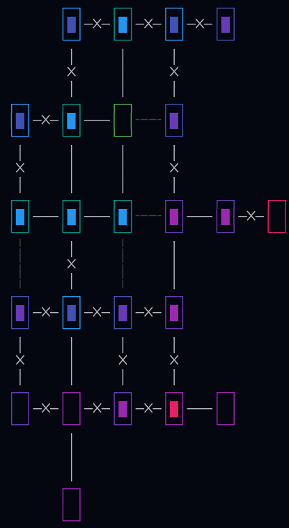

This is a layer based ZDG algorithm.

The process, in short:
1. Start in a random coordinate
2. Initialize the first layer with a single room at that coordinate
3. Choose some x rooms to create for the next layer
4. Find available open coordinates next to rooms on the previous and current layer
5. Fill one space with a new room
6. Go back to 4 some x times
7. Lock connections between current and previous layer (Unless on the second layer)
8. Spread keys on any previous layer for number of locked connections
9. Go back to 3 for some y times
10. Create the boss room on any available space
11. Place key on a room in the final (non-boss) layer
